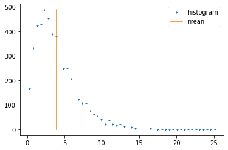
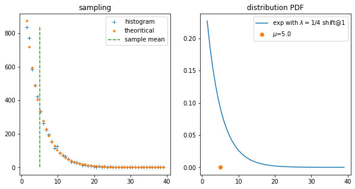
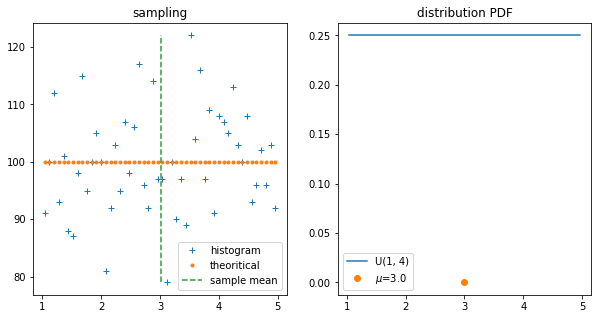
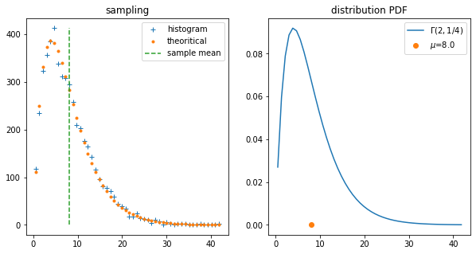

# Law of Large Numbers


r.v. X of *any* distribution

$\overline X_n$ sample mean (mean of n observations of the random variable)<br>
    $\overline X_n = \frac{X_1 + X_2 + ...+ X_n}{n}$

The law of large numbers just says that the sample mean will approach the population mean, while the sample size n approaching infinity.<br>
$\begin{aligned}\boxed{\lim_{n\to \infty} \overline X_n = E(X)} \end{aligned}$

### example


```python
import numpy as np

# generate 1000 numbers from standard normal distribution
data_stdNorm = np.random.randn(1000)
print("sample mean on N(0, 1): ", np.mean(data_stdNorm)) # shall be close to 0
# For random samples from $N(\mu, \sigma^2)$, use:
# sigma * np.random.randn(...) + mu
data_norm = 3 * np.random.randn(1000) + 5.0 # sample size 30 seems already good
print("sample mean on N(5, 3): ", np.mean(data_norm))
```

    sample mean on N(0, 1):  0.016817738881363314
    sample mean on N(5, 3):  5.02387814626222
    

## how about some other, not normal distributions

##### gamma distribution
 with shape parameter k=2, scale parameter $\theta=2$, population mean (by analysis) $E(X) = k\theta$ = 4.


```python
data_gamma = np.random.gamma(shape=2., scale=2., size=5000)
sample_mean = np.mean(data_gamma)
hist, bin_edges = np.histogram(data_gamma, bins=50)
binlocs = (bin_edges[:-1] + bin_edges[1:])/2.0

import matplotlib.pyplot as plt
plt.figure()
plt.plot(binlocs, hist, '+', ms=3, label='histogram')
plt.plot([sample_mean, sample_mean], [np.min(hist), np.max(hist)], '-', label='mean')
plt.legend()
plt.show()

print("sample mean on gamma distribution(k=2, 𝜃=2): ", np.mean(data_gamma))
```





    sample mean on gamma distribution(k=2, 𝜃=2):  3.972279711060542
    

Obviously, the sample mean is quite close to the population mean E(X) = 4.

##### check for some other distributions
- exponential distribution with $\lambda=\frac{1}{4}$ shift by 1,<br>i.e.
    $f(x) = \frac{1}{4} e^{-\frac{1}{4}(x-1)}, x>0$ <br>
    $E(X) = \frac{1}{\lambda} + shift$ = 5, $Var(X) = \frac{1}{\lambda^2}$
- uniform distribution on [1, 5], 
    $$
    f(x) = 
        \begin{cases}
            \frac{1}{b-a} ,& \text{if } a<x<b \\
            0 ,& \text{otherwise}
        \end{cases}
    $$
    $E(X) = \frac{a + b}{2}$ = 3 (i.e. at middle the area)
- gamma distribution with $\alpha=2$ (shape parameter k), $\beta=\frac{1}{4}$ (or scale parameter $\theta=\frac{1}{\beta}$ = 4), <br>
    $f(x) = \frac{\beta^\alpha}{\Gamma(\alpha)} x^{\alpha-1} e^{-\beta x}$, x>0 <br>
    $E(X) = \frac{\alpha}{\beta}$,  $V(X) = \frac{\alpha}{\beta^2}$


```python
from scipy import stats

# transformation: (X - loc)/scale
print("sample mean on exponential distribution: ",
      np.mean(stats.expon.rvs(loc=1, scale=4, size=5000)))

def plotRVSampling(rv, size, binNum, distNote):
    """
    visualize the sampling
    inputs:
    - rv : r.v. frozen
    - size: sampling size
    - binNum: # of bins
    - name: distribution name
    """
    data = rv.rvs(size)
    sample_mean = np.mean(data)
    hist, bin_edges = np.histogram(data, bins=binNum)
    binlocs = (bin_edges[:-1] + bin_edges[1:]) / 2.0
    pdf = rv.pdf(binlocs)
    cdf = rv.cdf(bin_edges)
    bycdf = (cdf[1:] - cdf[:-1]) * size
    plt.figure(figsize=(10,5))
    plt.subplot(121)
    plt.title('sampling')
    plt.plot(binlocs, hist, '+', ms=6, label='histogram')
    plt.plot(binlocs, bycdf, 'o', ms=3, label='theoritical')
    plt.plot([sample_mean, sample_mean], [np.min(hist), np.max(hist)],
             '--', label='sample mean')
    plt.legend()
    plt.subplot(122)
    plt.title('distribution PDF')
    plt.plot(binlocs, pdf, '-', label=distNote)
    plt.plot(rv.mean(), 0, 'o', label='$\mu$='+str(rv.mean()))
    plt.legend()
    plt.show()
    
rv_exp = stats.expon(loc=1, scale=4)
plotRVSampling(rv_exp, 5000, 50, "exp with $\lambda=1/4$ shift@1")

rv_uni = stats.uniform(loc=1, scale=4)
plotRVSampling(rv_uni, 5000, 50, "U(1, 4)")

rv_gamma = stats.gamma(a=2, loc=0, scale=4)
plotRVSampling(rv_gamma, 5000, 50, "$\Gamma(2, 1/4)$")
```

    sample mean on exponential distribution:  5.05647460186006
    











```python

```
