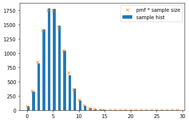
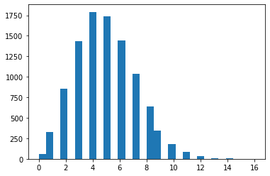

### Poisson distribution
$\begin{aligned} P(X = k) &= \lim_{n\to\infty} {n\choose k} {\left(\frac{\lambda}{n}\right)}^k {\left(1-\frac{\lambda}{n}\right)}^{n-k} \\ &= \frac{\lambda ^k}{k!} e^{-k} \end{aligned}$


```python
import numpy as np
import matplotlib.pyplot as plt

N = 10000
rvs_poisson = np.random.poisson(lam=5, size=N)
plt.figure()
plt.hist(rvs_poisson, bins=30, label='sample hist')

import scipy.stats as stats
rvp = stats.poisson(5)
xs = np.arange(0, 30)
bypdf = rvp.pmf(xs) * N
plt.plot(xs, bypdf, 'x', label='pmf * sample size')
plt.legend()
plt.show()

print('sample means = ', np.sum(rvs_poisson)/N)
```





    sample means =  4.9861
    

How about binomial distribution samples with same means? <br>
    taking e.g. $n=1000, p = \frac\lambda n = 0.005$


```python
rvs_binomial = np.random.binomial(1000, 0.005, size=10000)
plt.hist(rvs_binomial, bins=30)
plt.show()
print('sample means = ', np.sum(rvs_binomial)/10000)
```





    sample means =  4.9768
    

This approximates the poisson distribution well.
That's it!

Poisson distribution is the limit of the binomial distribution, while n goes to infinity.

Now, some statistics:<br>
$E(X) = \lambda$, that's obvious by definition.<br>
$Var(X) = \lambda$

Characteristic function<br>
$\psi(t) = e^{\lambda (e^{jt} -1)}$


```python

```
